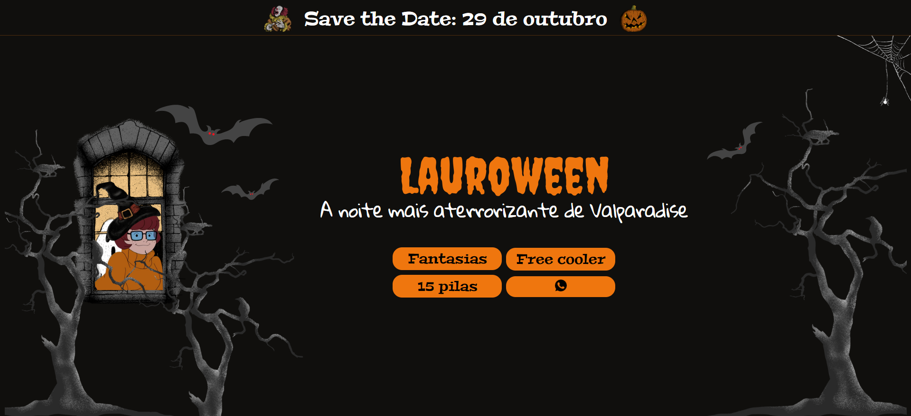

# Convite de Festa
Este é um convite para uma festa de Halloween criado em CSS e HTML. Simples e com um unico botão que direciona ao grupo de whatsapp organizado pela dona da festa. 
O design foi criado com o Canva e os elementos visuais são todos do site.

O site pode ser acessado clicando no link abaixo: 
<a target="_blank" href="https://gabrielarib.github.io/convitedefesta/">Convite de Halloween</a>

